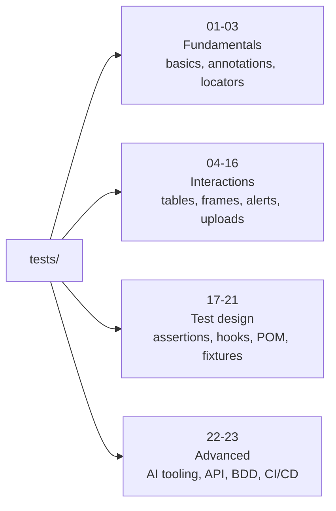
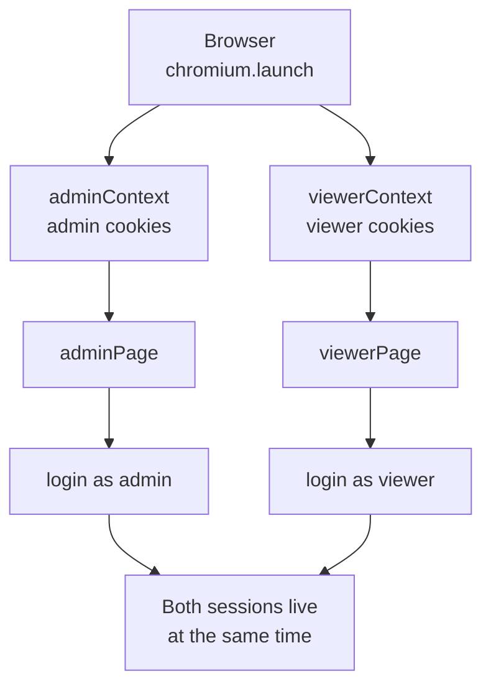

# Learning Playwright Fundamentals 3x

Hands-on Playwright + TypeScript practice repo used in **The Testing Academy** Playwright Fundamentals batch.
Everything here is beginner friendly: install Playwright, run the sample tests, record your own tests with codegen, and read the HTML report.

> Maintained by [Pramod Dutta](https://github.com/PramodDutta) · [The Testing Academy](https://thetestingacademy.com)

---

## Playwright architecture


Playwright is a **client-server** tool. Understanding the three tiers explains most of its behaviour:

1. **Client libraries** - your test code. Playwright supports JavaScript/TypeScript natively and ships bindings for Java, Python, C# and (community) PHP. Every binding talks the same wire protocol, so the API is nearly identical across languages.
2. **WebSocket connection (`ws://`)** - the client opens a single, persistent, bidirectional connection to the Playwright server and keeps it open for the whole session. One connection carries every command and every event, which is why Playwright is fast and why it can stream events (console logs, network, dialogs) back to your test in real time. Contrast this with tools that open a new HTTP request per command.
3. **Node.js server** - the driver process. It translates your API calls into browser protocol messages, and it runs on Node even when your tests are written in Python or Java.
4. **Browser rendering processes** - the server speaks **CDP** (Chrome DevTools Protocol) to Chromium, and a **patched/extended protocol (CDP+)** to the Playwright builds of Firefox and WebKit. This is why Playwright ships its own browser binaries: the Firefox and WebKit builds carry patches that expose a CDP-like surface.

**Why this matters when you write tests**

| Architecture fact | What you get |
|---|---|
| One persistent WebSocket | Fast execution, no per-command HTTP overhead |
| Server streams events back | Auto-waiting, `page.on('request')`, dialog handling, tracing |
| Server owns the browser | Parallel isolated `BrowserContext`s instead of full browser restarts |
| Patched Firefox/WebKit | Same API across all three engines, hence `npx playwright install` |

---

## 1. Prerequisites

| Tool | Version | Check with |
|------|---------|-----------|
| Node.js | 18 or higher (20+ recommended) | `node -v` |
| npm | comes with Node | `npm -v` |
| VS Code | latest (optional but recommended) | - |
| Git | latest | `git --version` |

Download Node.js from https://nodejs.org (pick the LTS build).

---

## 2. Clone and install

```bash
git clone https://github.com/PramodDutta/LearningPlaywrightFundamentals3x.git
cd LearningPlaywrightFundamentals3x

# install project dependencies (@playwright/test, @types/node)
npm install

# download the browser binaries Playwright drives (Chromium, Firefox, WebKit)
npx playwright install
```

On Linux you may also need the OS libraries:

```bash
npx playwright install --with-deps
```

Only need one browser? `npx playwright install chromium`

---

## 3. Setting up a Playwright project from scratch

If you want to build this project yourself instead of cloning, this is the exact flow:

```bash
mkdir LearningPlaywrightFundamentals3x
cd LearningPlaywrightFundamentals3x

npm init -y
npm init playwright@latest
```

The installer asks four questions. Answers used in this repo:

| Question | Answer |
|----------|--------|
| TypeScript or JavaScript? | **TypeScript** |
| Where to put your end-to-end tests? | **tests** |
| Add a GitHub Actions workflow? | your choice (`false` here) |
| Install Playwright browsers? | **true** |

It scaffolds:

```
playwright.config.ts     # all Playwright settings
tests/example.spec.ts    # first sample test
package.json             # scripts + devDependencies
.gitignore
```

Manual alternative (what `npm init playwright` does under the hood):

```bash
npm i -D @playwright/test @types/node
npx playwright install
```

---

## 4. Project structure

```
LearningPlaywrightFundamentals3x/
├── tests/                     # numbered curriculum, one folder per topic (see section 5)
│   ├── 01_Basics/
│   │   ├── 216_example.spec.ts       # title assertions on playwright.dev (viewer + admin)
│   │   ├── 217_multiple_context.ts   # two isolated sessions in one browser
│   │   ├── 218_normal_pw.ts          # raw library script: Browser -> Context -> Page
│   │   ├── 219_tta-check.spec.ts     # login flow on the TTA practice site (codegen)
│   │   ├── 220_BCP.spec.ts           # the three-level hierarchy, logged step by step
│   │   ├── 221_TA.spec.ts            # three role contexts via the browser fixture
│   │   └── 222_Test_Options.spec.ts  # viewport, locale, timezone, geolocation, mobile
│   ├── 02_TestAnnotations/
│   │   ├── 223_TestAnnotations.spec.ts  # skip, only, fail, fixme, slow
│   │   └── 224_TestDescribe.spec.ts     # grouping tests with describe
│   ├── 03_Locator_Commands/
│   │   ├── 225_LC.spec.ts            # goto options: waitUntil, timeout, referer
│   │   ├── 226_Refere.spec.ts        # context-wide referer via extraHTTPHeaders
│   │   ├── 227_Fresh.spec.ts         # CSS selectors on the VWO login form
│   │   └── 228_Project3.spec.ts      # XPath, strict mode and .first()
│   └── 04_.. 23_/             # remaining topics, see the curriculum table
├── docs/images/               # architecture diagram (png + html source)
├── playwright.config.ts       # testDir, reporter, trace, headless, projects
├── package.json
├── playwright-report/         # generated HTML report (git ignored)
├── test-results/              # traces, screenshots, videos (git ignored)
└── README.md
```

---

## 5. The curriculum: how `tests/` is organised

**Concept:** The `tests/` folder is a numbered syllabus, not a flat dump. Each folder is one topic, in the order it is taught, and specs inside carry a running lesson number (`225_LC.spec.ts`) so a file always maps back to the class it came from.

**Why:** A flat `tests/` folder stops being navigable at about fifteen files; numbered topic folders let you jump straight to the lesson you are revising and let the runner target one topic with a path filter.

**Q&A - why use this?**
- **Q: Do I need to change `playwright.config.ts` for nested folders?** A: No. `testDir: './tests'` recurses into every subfolder automatically, so specs are discovered at any depth.
- **Q: Why keep `.gitkeep` files in the empty folders?** A: Git tracks files, not directories. Without a placeholder, an empty topic folder simply would not exist for anyone who clones the repo.
- **Q: How do I run just one topic?** A: Pass the folder as a path filter: `npx playwright test tests/02_TestAnnotations`. Everything else is skipped.



| # | Topic | # | Topic |
|---|---|---|---|
| 01 | Basics | 13 | Shadow DOM |
| 02 | Test Annotations | 14 | File Upload |
| 03 | Locator Commands | 15 | File Download |
| 04 | Session Storage | 16 | Scroll to Element |
| 05 | Allure Reporting | 17 | Expect Assertions |
| 06 | Multiple Element Filter | 18 | Test Hooks |
| 07 | WebTables | 19 | Data Driven Testing |
| 08 | Web Select, Frames, Iframe | 20 | Page Object Model |
| 09 | Frame / Iframe | 21 | Fixture |
| 10 | Keyboard, Hover, Drag Drop, Calendar | 22 | Misc AI Concepts |
| 11 | JS Alerts | 23 | Advance PW Framework |
| 12 | Handle SVG | | |

The last two folders branch further:

```
22_Misc_AI_Concepts/          23_Advance_PW_Framework/
├── 01_Playwright_MCP         ├── 01_API_Testing
├── 02_Playwright_CLI         ├── 02_Cucumber BDD
├── 03_Playwright_AI_Agents   ├── 03_AI_Agent Factory
├── 04_Selenium_To_PW_Migration  └── 04_CI_CD
└── 05_SKILL_PW_36                  ├── Github Actions
                                    └── Jenkins
```

---

## 6. Running the tests

```bash
# run everything
npx playwright test

# run a single file
npx playwright test tests/01_Basics/219_tta-check.spec.ts

# run one test by title
npx playwright test -g "admin"

# headed mode (watch the browser)
npx playwright test --headed

# UI mode: the best way to learn, time travel + watch mode
npx playwright test --ui

# debug mode with the Playwright Inspector
npx playwright test --debug

# pick a browser project
npx playwright test --project=chromium

# run serially, useful while debugging
npx playwright test --workers=1

# run one topic folder from the curriculum
npx playwright test tests/02_TestAnnotations
```

The two library scripts in `01_Basics/` are not specs, so the runner skips them. Run those directly:

```bash
npx tsx tests/01_Basics/218_normal_pw.ts
npx tsx tests/01_Basics/217_multiple_context.ts
```

Open the report after a run:

```bash
npx playwright show-report
```

These npm scripts are already wired up in `package.json`:

```bash
npm test            # playwright test
npm run test:headed # playwright test --headed
npm run test:ui     # playwright test --ui
npm run test:debug  # playwright test --debug
npm run report      # playwright show-report
npm run codegen     # playwright codegen
```

---

## 7. Codegen: record tests instead of writing them

Codegen opens a browser, watches what you click and type, and writes the Playwright code for you. It prefers user-facing locators (`getByRole`, `getByLabel`, `getByTestId`) over brittle CSS/XPath.

### Basic recording

```bash
npx playwright codegen
```

### Record starting at a URL

```bash
npx playwright codegen https://app.thetestingacademy.com/playwright/multiple_element_filter
```

### Save the recording straight into a spec file

```bash
npx playwright codegen --target=javascript -o tests/new-test.spec.ts https://playwright.dev
```

For TypeScript output:

```bash
npx playwright codegen --target=playwright-test -o tests/new-test.spec.ts https://playwright.dev
```

### Useful codegen flags

| Flag | What it does |
|------|--------------|
| `-o, --output <file>` | write the generated code to a file |
| `--target=<lang>` | `playwright-test`, `javascript`, `python`, `java`, `csharp` |
| `-b, --browser <name>` | `chromium` (default), `firefox`, `webkit` |
| `--device="iPhone 13"` | emulate a mobile device |
| `--viewport-size=1280,720` | set the window size |
| `--color-scheme=dark` | record in dark mode |
| `--timezone="Asia/Kolkata"` | set the timezone |
| `--geolocation="28.6139,77.2090"` | set coordinates |
| `--save-storage=auth.json` | save cookies + localStorage after login |
| `--load-storage=auth.json` | start already logged in |
| `--ignore-https-errors` | skip certificate warnings |

### Record a logged-in session (very common)

```bash
# 1. log in manually, then close the browser. state is saved.
npx playwright codegen --save-storage=playwright/.auth/user.json https://example.com/login

# 2. reuse that session for the next recording, no login steps needed
npx playwright codegen --load-storage=playwright/.auth/user.json https://example.com/dashboard
```

### Codegen toolbar

While recording you get a small toolbar with three modes:

- **Record** - captures your actions as code
- **Pick locator** - hover any element and copy its best locator
- **Assert visibility / text / value** - generate `expect()` assertions by clicking

Codegen output is a starting point, not a final test. Clean it up: remove stray `click()` before `fill()`, add assertions, extract repeated steps.

### Pick a locator without recording a whole test

```bash
# from the terminal
npx playwright codegen --  # then use Pick locator

# or from a paused test
await page.pause();
```

`page.pause()` inside a test opens the Inspector so you can step through and explore locators live.

---

## 8. What is inside the sample tests

**tests/01_Basics/216_example.spec.ts** - the classic first test, asserts the page title. Two tests here, `viewer` and `admin`, so you can watch the runner spin up an isolated context per test and run them in parallel.

```ts
import { test, expect } from '@playwright/test';

test('viewer', async ({ page }) => {
  await page.goto('https://playwright.dev/');
  await expect(page).toHaveTitle("Fast and reliable end-to-end testing for modern web apps | Playwright");
});

test('admin', async ({ page }) => {
  await page.goto('https://playwright.dev/');
  await expect(page).toHaveTitle("Fast and reliable end-to-end testing for modern web apps | Playwright");
});
```

Each `test()` gets its own `page`, and each `page` comes from its own fresh `BrowserContext`. That is the runner doing by hand what section 10 does manually.

**tests/01_Basics/219_tta-check.spec.ts** - a codegen recording against the TTA practice site, showing `getByRole` and `getByTestId` locators on a login form.

**tests/01_Basics/218_normal_pw.ts** and **217_multiple_context.ts** - plain library scripts, not specs. See sections 9 and 10.

---

## 9. The Playwright object model: Browser -> Context -> Page

**Concept:** Every Playwright script sits on a three-level hierarchy. A `Browser` is the launched binary (one heavy OS process), a `BrowserContext` is an isolated incognito-style profile inside it (its own cookies, localStorage, cache), and a `Page` is a single tab inside that context.

**Why:** Restarting a whole browser per test is slow; a fresh `BrowserContext` gives you the same clean-slate isolation in milliseconds instead of seconds.

**Q&A - why use this?**
- **Q: When do I write this by hand instead of using `test({ page })`?** A: Only for scripts outside the test runner - scrapers, demos, one-off automation. Inside `@playwright/test` the runner already builds a fresh context and page for you.
- **Q: What does a new context actually reset?** A: Cookies, localStorage, sessionStorage, permissions, and cache. What it does NOT reset is the browser process itself, which is why it is fast.
- **Q: What's the gotcha?** A: Cleanup order. Close in reverse of creation - page, then context, then browser. Forgetting `browser.close()` leaves a Chromium process alive after the script exits.

```mermaid
flowchart TD
    A["chromium.launch&#40;&#41;"] --> B[Browser<br/>one OS process]
    B --> C["browser.newContext&#40;&#41;"]
    C --> D[BrowserContext<br/>isolated cookies + storage]
    D --> E["context.newPage&#40;&#41;"]
    E --> F[Page<br/>a single tab]
    F --> G["page.close&#40;&#41;"]
    G --> H["context.close&#40;&#41;"]
    H --> I["browser.close&#40;&#41;"]
```



**tests/01_Basics/218_normal_pw.ts** - the hierarchy spelled out with explicit TypeScript types:

```ts
import { chromium, Browser, BrowserContext, Page } from "playwright";

async function run() {
    const browser: Browser = await chromium.launch({ headless: false });
    const context: BrowserContext = await browser.newContext();
    const page: Page = await context.newPage();

    await page.goto("https://example.com");
    console.log("Title:", await page.title());   // Title: Example Domain

    // Cleanup - reverse order of creation
    await page.close();
    await context.close();
    await browser.close();
}

run();
```

Note the import: `playwright`, **not** `@playwright/test`. This is the raw library, so the file has no `test()` blocks and is deliberately named `.ts` rather than `.spec.ts` - the runner's default `testMatch` only picks up `*.spec.ts` / `*.test.ts`, so `npx playwright test` ignores it.

Run a library script with a TypeScript executor:

```bash
npx tsx tests/01_Basics/218_normal_pw.ts
# or: npx ts-node tests/01_Basics/218_normal_pw.ts
```

| | Library (`playwright`) | Test runner (`@playwright/test`) |
|---|---|---|
| You create the browser | yes, manually | no, fixtures do it |
| Assertions | bring your own | `expect` with auto-retry |
| Parallelism, retries, report | you build it | built in |
| Use it for | scraping, scripts, demos | actual test suites |

---

## 10. Multiple contexts: two logged-in users, one browser

**Concept:** One `Browser` can host many `BrowserContext`s at the same time, and each one carries its own session. That lets a single script drive an admin and a viewer side by side without logging out in between.

**Why:** Multi-role flows (admin approves, viewer sees the result) are impossible in one shared session because a second login overwrites the first one's cookies.

**Q&A - why use this?**
- **Q: When do I reach for it?** A: Any test with two roles at once - admin vs viewer, chat sender vs receiver, seller vs buyer.
- **Q: What does it replace?** A: Launching a second browser, or logging out and back in mid-test. Both are far slower and flakier.
- **Q: What's the gotcha?** A: Contexts are isolated, not synchronised. Nothing waits for the other user, so after the admin acts you still need an explicit `expect` on the viewer page to wait for the change.



**tests/01_Basics/217_multiple_context.ts** - two isolated sessions against the same app:

```ts
import { chromium } from "playwright";

async function multiUserTest() {
    const browser = await chromium.launch({ headless: false });

    // Admin session
    const adminContext = await browser.newContext();
    const adminPage = await adminContext.newPage();
    await adminPage.goto("https://app.vwo.com/login");
    console.log("Admin: on login page");

    // Viewer session - separate cookies, same browser
    const viewerContext = await browser.newContext();
    const viewerPage = await viewerContext.newPage();
    await viewerPage.goto("https://app.vwo.com/login");
    console.log("Viewer: on login page");

    await adminContext.close();
    await viewerContext.close();
    await browser.close();
}

multiUserTest();
```

The same idea inside the test runner, where you ask for the `browser` fixture instead of `page`. **tests/01_Basics/221_TA.spec.ts** takes it to three roles:

```ts
test("BCP - three roles at once", async ({ browser }) => {
    const adminContext = await browser.newContext();
    const userContext  = await browser.newContext();
    const guestContext = await browser.newContext();

    const adminPage = await adminContext.newPage();
    await adminPage.goto("https://app.thetestingacademy.com/playwright/");

    const userPage = await userContext.newPage();
    await userPage.goto("https://sdet.live");

    const guestPage = await guestContext.newPage();
    await guestPage.goto("https://scrolltest.com");

    await adminPage.close();
    await userPage.close();
    await guestPage.close();
});
```

Ask for `browser` and you own the contexts; ask for `page` and the runner makes one context for you. Note that closing the pages does not close the contexts, in a long suite close the contexts too or they accumulate.

Once each role has a saved storage state, `newContext({ storageState: 'admin.json' })` skips the login UI entirely - see the `--save-storage` codegen flag in section 7.

---

## 11. Context options: viewport, locale, timezone, geolocation

**Concept:** `browser.newContext()` takes an options object that configures the emulated environment for every page in that context, screen size, language, timezone, GPS coordinates, permissions and device characteristics.

**Why:** Testing a French user in Paris on an iPhone otherwise means changing your OS settings; context options make that environment a per-test argument instead.

**Q&A - why use this?**
- **Q: When do I reach for it?** A: Localisation checks, "near me" features that read GPS, and responsive layouts. Anything where the app behaves differently based on who or where the user is.
- **Q: What does it replace?** A: Separate browser profiles, VPNs, and real devices for the common cases. One browser can run a Paris mobile context and a New York desktop context at once.
- **Q: What's the gotcha?** A: `geolocation` is ignored unless you also grant `permissions: ['geolocation']`. The page asks the browser, the browser checks the permission, and a context without it silently returns nothing.

```mermaid
flowchart TD
    A["browser.newContext&#40;options&#41;"] --> B[viewport<br/>1920x1080]
    A --> C[locale<br/>fr-FR]
    A --> D[timezoneId<br/>Europe/Paris]
    A --> E[geolocation<br/>lat + long]
    A --> F[permissions<br/>grants geolocation]
    B & C & D & E & F --> G[Every page in<br/>this context inherits it]
```



**tests/01_Basics/222_Test_Options.spec.ts** - a French desktop user in Paris:

```ts
test('context with options', async ({ browser }) => {
    const context = await browser.newContext({
        viewport: { width: 1920, height: 1080 },
        locale: 'fr-FR',
        timezoneId: 'Europe/Paris',
        geolocation: { latitude: 48.8566, longitude: 2.3522 },
        permissions: ['geolocation'],   // without this, geolocation is ignored
    });
    const page = await context.newPage();
    await page.goto('https://app.vwo.com/#login');
    await context.close();
});
```

The same file emulates a phone by hand:

```ts
const iPhone = {
    viewport: { width: 375, height: 667 },
    userAgent: 'Mozilla/5.0 (iPhone; CPU iPhone OS 14_0 like Mac OS X)',
    deviceScaleFactor: 2,
    isMobile: true,
    hasTouch: true,
};
const context = await browser.newContext(iPhone);
```

Playwright ships those descriptors already, so in real suites prefer the built-in list over hand-rolled objects:

```ts
import { devices } from '@playwright/test';
const context = await browser.newContext({ ...devices['iPhone 13'] });
```

---

## 12. Test annotations: skip, only, fail, fixme, slow

**Concept:** Annotations are modifiers you attach to a `test()` to change whether and how it runs, and `test.describe()` groups related tests under a shared name.

**Why:** Real suites always contain tests that are broken, unfinished, or known-failing; annotations record that intent in code instead of in a commented-out block nobody ever restores.

**Q&A - why use this?**
- **Q: What's the difference between `skip` and `fixme`?** A: Both stop the test running. `skip` means "not applicable here" (wrong browser, wrong environment), `fixme` means "this is broken and someone owes it a fix".
- **Q: What does `fail` do that `skip` doesn't?** A: `test.fail()` still runs the test and expects it to fail. If the bug gets fixed and the test starts passing, the run turns red to tell you the annotation is now stale.
- **Q: What's the gotcha?** A: `test.only` silently disables every other test in its file, and `forbidOnly` in this repo's config fails the whole CI build if one is committed. Never push it.

```mermaid
flowchart TD
    T[test&#40;&#41;] --> S["test.skip&#40;&#41;<br/>never runs"]
    T --> O["test.only&#40;&#41;<br/>runs, silences the file"]
    T --> F["test.fail&#40;&#41;<br/>runs, must fail"]
    T --> X["test.fixme&#40;&#41;<br/>skipped, flagged broken"]
    T --> L["test.slow&#40;&#41;<br/>runs, 3x timeout"]
    S --> R[Report]
    O --> R
    F --> R
    X --> R
    L --> R
```



**tests/02_TestAnnotations/223_TestAnnotations.spec.ts**:

```ts
test.skip('checkout with PayPal', async ({ page }) => {
  // never executes
});

test.fail('cart total is wrong, BUG-451', async () => {
  expect(90).toBe(100);   // expected to fail, green when it does
});

test.fixme('upload 2GB file', async () => {
  // skipped, but flagged as "needs fixing"
});

test('full regression report', async () => {
  test.slow();
  console.log(test.info().timeout);   // 90000 instead of 30000
});

// conditional: skip only on the browser that is broken
test('mobile layout', async ({ page, browserName }) => {
  test.fixme(browserName === 'webkit', 'Safari renders menu wrong');
  await page.goto("https://sdet.live");
});
```

**tests/02_TestAnnotations/224_TestDescribe.spec.ts** - grouping with `describe`, which makes the group name part of every test title:

```ts
test.describe('Login Page', () => {
  test('valid credentials', async ({ page }) => { /* ... */ });
  test('invalid password',  async ({ page }) => { /* ... */ });
  test.fixme('checkout with PayPal', async ({ page }) => { /* ... */ });
});
```

Run one group by its describe name:

```bash
npx playwright test -g "Login Page"
```

| Annotation | Runs? | Use it when |
|---|:---:|---|
| `test.skip` | no | not applicable in this environment |
| `test.fixme` | no | broken, needs a fix |
| `test.fail` | yes | known bug, must keep failing |
| `test.slow` | yes | legitimately needs 3x the timeout |
| `test.only` | yes | local debugging only, never commit |

---

## 13. playwright.config.ts explained

```ts
export default defineConfig({
  testDir: './tests',              // where specs live
  fullyParallel: true,             // run test files in parallel
  forbidOnly: !!process.env.CI,    // fail CI if test.only is left behind
  retries: process.env.CI ? 2 : 0, // retry flaky tests on CI only
  workers: process.env.CI ? 1 : undefined,
  reporter: 'html',                // HTML report in playwright-report/
  use: {
    trace: 'on-first-retry',       // record a trace when a test retries
    headless: false                // show the browser locally
  },
  projects: [
    { name: 'chromium', use: { ...devices['Desktop Chrome'] } }
  ]
});
```

Add Firefox and WebKit by extending `projects`:

```ts
projects: [
  { name: 'chromium', use: { ...devices['Desktop Chrome'] } },
  { name: 'firefox',  use: { ...devices['Desktop Firefox'] } },
  { name: 'webkit',   use: { ...devices['Desktop Safari'] } },
]
```

---

## 14. Traces and debugging

```bash
# force a trace for every test
npx playwright test --trace on

# open a saved trace
npx playwright show-trace test-results/<folder>/trace.zip
```

The trace viewer gives you a DOM snapshot per action, network calls, console logs, and a timeline. It is the fastest way to answer "why did this fail on CI".

---

## 15. VS Code extension

Install **Playwright Test for VSCode** (Microsoft). It gives you:

- run/debug a single test from the gutter
- **Record new** and **Record at cursor** buttons (codegen inside the editor)
- **Pick locator** from the Testing sidebar
- breakpoints in TypeScript with live browser stepping

---

## 16. Navigation: `page.goto()` options and referers

**Concept:** `page.goto()` takes an options object that decides how long Playwright waits before handing control back (`waitUntil`), how long it waits before giving up (`timeout`), and what `Referer` header the request carries.

**Why:** The default `waitUntil: 'load'` waits for every image and stylesheet, which is wasted time on a heavy page when all you need is the DOM.

**Q&A - why use this?**
- **Q: Which `waitUntil` do I actually want?** A: `domcontentloaded` for most tests, the HTML is parsed and your locators can resolve. `commit` when you only care that the server responded and want to start asserting immediately.
- **Q: What does `referer` here replace?** A: Hand-building a header on every call. It sets `Referer` for that one navigation, useful when an app gates content or analytics on where the traffic came from.
- **Q: What's the gotcha?** A: This `referer` applies to a single `goto` only. For every request in the session, set `extraHTTPHeaders` on the context instead.

```mermaid
flowchart LR
    A["page.goto&#40;url, options&#41;"] --> B{waitUntil}
    B -->|commit| C[response received<br/>fastest]
    B -->|domcontentloaded| D[HTML parsed<br/>good default]
    B -->|load| E[images + CSS done<br/>the default]
    B -->|networkidle| F[no requests 500ms<br/>discouraged, flaky]
```



**tests/03_Locator_Commands/225_LC.spec.ts** - all three options together:

```ts
test("Verify X", async ({ page }) => {
    await page.goto(
        "https://app.thetestingacademy.com/playwright/multiple_element_filter",
        { waitUntil: 'commit' }
    );

    const response = await page.goto('https://app.thetestingacademy.com/login', {
        waitUntil: 'domcontentloaded',
        timeout: 45000,
        referer: 'https://thetestingacademy.com'
    });
});
```

`goto` returns the main resource response, so you can assert on the status directly:

```ts
expect(response?.status()).toBe(200);
```

**tests/03_Locator_Commands/226_Refere.spec.ts** - the context-wide version, where every request in the session carries the header:

```ts
test("set referer for entire context", async ({ browser }) => {
    const context = await browser.newContext({
        extraHTTPHeaders: { "Referer": "https://thetestingacademy.com" }
    });
    const page = await context.newPage();

    await page.goto("https://app.vwo.com/#login");                            // referer sent
    await page.goto("https://katalon-demo-cura.herokuapp.com/profile.php");   // referer sent
});
```

| Need | Use |
|---|---|
| One navigation carries the header | `goto(url, { referer })` |
| Every request in the session carries it | `newContext({ extraHTTPHeaders })` |
| Every request in the whole suite | `use: { extraHTTPHeaders }` in the config |

---

## 17. CSS selectors and the default locator strategies

**Concept:** Before Playwright's `getByRole` family there were four classic hooks on an element, `id`, `name`, `class` and tag, and CSS selector syntax is how you reach each of them through `page.locator()`.

**Why:** Not every app is accessible enough for role-based locators; when a field has no label and no test id, a stable `id` is the next best anchor.

**Q&A - why use this?**
- **Q: When do I reach for a CSS selector?** A: When the user-facing locators cannot see the element, typically unlabelled inputs, or when the app already has stable `id` attributes you control.
- **Q: What does it replace?** A: XPath, in almost every case. CSS is shorter, faster and far more readable.
- **Q: What's the gotcha?** A: Framework-generated classes (`text-input W&#40;100%&#41;`) and obfuscated attributes (`data-qa="hocewoqisi"`) change on every build. Anchor on `id` or a `data-testid` you own, never on styling classes.

```mermaid
flowchart TD
    A[Element] --> B["id -> #login-username"]
    A --> C["class -> .text-input"]
    A --> D["name -> [name='username']"]
    A --> E["tag -> input"]
    B & C & D & E --> F["page.locator&#40;selector&#41;"]
    F --> G[Prefer getByRole / getByLabel<br/>when the app exposes them]
```



Given this real VWO login field:

```html
<input type="email" class="text-input W(100%)" name="username"
       id="login-username" data-qa="hocewoqisi" placeholder="Enter email ID">
```

**tests/03_Locator_Commands/227_Fresh.spec.ts** anchors on the stable ids and asserts the failure message:

```ts
test('tc#1 - Verify that the vwo page is loaded', async ({ page }) => {
    await page.goto("https://app.vwo.com", {
        waitUntil: 'domcontentloaded',
        referer: "https://sdet.live"
    });

    const userNameField = page.locator("#login-username");
    const passwordField = page.locator("#login-password");
    const loginButton   = page.locator("#js-login-btn");

    await userNameField.fill("admin@admin.com");
    await passwordField.fill("pass123");
    await loginButton.click();

    const errorMessage = page.locator('#js-notification-box-msg');
    await expect(errorMessage).toContainText(
        "Your email, password, IP address or location did not match");
});
```

| Hook | CSS syntax | Stable? |
|---|---|:---:|
| id | `#login-username` | yes, if hand written |
| name | `[name="username"]` | usually |
| class | `.text-input` | no, styling churns |
| tag | `input` | too broad on its own |
| test id | `[data-testid="login"]` | yes, you own it |

Two habits worth carrying out of this file: `page.pause()` is a debugging tool that halts the run and opens the Inspector, so strip it before committing; and a `timeout` under about 5000ms on a real-world site is a flake waiting to happen.

---

## 18. XPath, strict mode and why `.first()` shows up

**Concept:** Playwright accepts XPath anywhere a selector is expected (any string starting with `//` is treated as XPath), and it runs every locator in **strict mode**: if a locator matches more than one element, the action throws instead of silently picking one.

**Why:** Silently acting on "the first thing that matched" is how a test ends up clicking the wrong button for six months without anyone noticing; strict mode turns that into a loud failure on day one.

**Q&A - why use this?**
- **Q: When do I reach for XPath?** A: Rarely. Its one real advantage is matching on text or walking upward to a parent (`//div[contains(@class,'invalid-reason')]`), which CSS cannot do.
- **Q: What does `.first()` actually mean?** A: It opts that locator out of strict mode. It is an admission that the selector matches several elements and you decided the first one is fine.
- **Q: What's the gotcha?** A: `.first()` hides the ambiguity rather than fixing it. If the page order changes, the test silently targets a different element. Prefer narrowing the selector, and use `.filter({ hasText })` when you need to disambiguate by content.

```mermaid
flowchart TD
    A["page.locator&#40;selector&#41;"] --> B{How many<br/>elements match?}
    B -->|exactly 1| C[Action runs]
    B -->|0| D[Waits, then times out]
    B -->|2 or more| E[Strict mode violation]
    E --> F["Narrow the selector<br/>best fix"]
    E --> G[".filter&#40;{ hasText }&#41;<br/>disambiguate by content"]
    E --> H[".first&#40;&#41; / .nth&#40;i&#41;<br/>escape hatch"]
```



**tests/03_Locator_Commands/228_Project3.spec.ts** - XPath, attribute selectors and `.first()` on the Wingify trial form:

```ts
test("Verify the error message in the wingify free trial", async ({ page }) => {
    await page.goto("https://wingify.com/free-trial/");

    await page.locator("//input[@id='free-trial-step1-email']").fill("abccd");
    await page.locator("[data-qa='free-trial-step1-gdpr-consent-checkboxgdpr-consent-checkbox']").click();

    const errorMessage = page.locator("//div[contains(@class,'invalid-reason')]").first();
    await page.locator("//button[@data-qa='page-su-submit']").first().click();

    await expect(errorMessage).toContainText("The email address you entered is incorrect.");
});
```

**The one change worth making here.** The original file reads the text first and asserts on the string:

```ts
const text = await errorMessage.textContent();   // reads once, right now
expect(text).toContain("The email address you entered is incorrect.");
```

That assertion does not retry. It samples the DOM at the instant it runs, so if the error renders 50ms later the test fails on `null`. The web-first form polls until it matches or times out:

```ts
await expect(errorMessage).toContainText("The email address you entered is incorrect.");
```

| Form | Retries? | Use it when |
|---|:---:|---|
| `await expect(locator).toContainText(...)` | yes | almost always |
| `expect(await locator.textContent()).toContain(...)` | no | you need the raw string for other logic |

Since `//input[@id='free-trial-step1-email']` is just `#free-trial-step1-email` written the long way, the same selectors in idiomatic form:

```ts
page.locator("#free-trial-step1-email")              // instead of //input[@id='...']
page.getByRole('button', { name: 'Start free trial' })  // instead of //button[@data-qa='...']
```

---

## 19. Locator cheat sheet

```ts
page.getByRole('button', { name: 'Submit' })   // preferred, accessibility based
page.getByText('Welcome back')
page.getByLabel('Email Address')
page.getByPlaceholder('Enter your email')
page.getByTestId('login-button')               // needs data-testid
page.getByTitle('Close')
page.getByAltText('Company logo')

page.locator('.card').filter({ hasText: 'Pro' })
page.locator('li').nth(2)
page.locator('table tr').first()
```

Order of preference: role -> label -> placeholder -> text -> testid -> CSS/XPath. Section 17 covers the CSS end of that list, section 18 covers XPath and strict mode, for the cases where the user-facing locators cannot reach the element.

---

## 20. Common assertions

```ts
await expect(page).toHaveTitle(/Playwright/);
await expect(page).toHaveURL('https://example.com/dashboard');
await expect(locator).toBeVisible();
await expect(locator).toHaveText('Logged in');
await expect(locator).toContainText('Welcome');
await expect(locator).toHaveValue('pramod');
await expect(locator).toBeEnabled();
await expect(locator).toHaveCount(5);
```

All `expect` calls auto-wait, so you rarely need `waitForTimeout`.

---

## 21. Troubleshooting

| Problem | Fix |
|---------|-----|
| `Executable doesn't exist` | run `npx playwright install` |
| Browser closes instantly | that is normal in headless mode, use `--headed` or `--debug` |
| `test.only` blocked on CI | remove `.only`, `forbidOnly` is on |
| Test flaky on CI, fine locally | run `--trace on`, open the trace, look at the failing action |
| Codegen picks ugly CSS locators | add `data-testid` attributes to the app |
| Port/proxy issues on a corporate network | `HTTPS_PROXY=... npx playwright install` |

---

## 22. Useful links

- Playwright docs: https://playwright.dev/docs/intro
- Codegen guide: https://playwright.dev/docs/codegen
- Locators: https://playwright.dev/docs/locators
- Trace viewer: https://playwright.dev/docs/trace-viewer
- Practice site used here: https://app.thetestingacademy.com/playwright/
- The Testing Academy: https://thetestingacademy.com

---

## License

MIT
